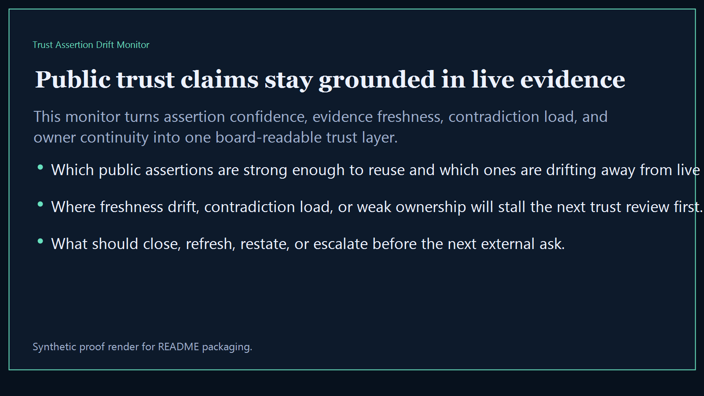
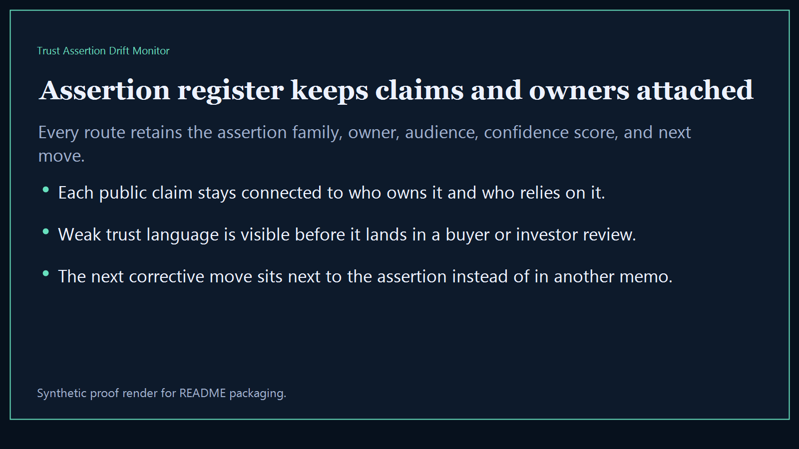
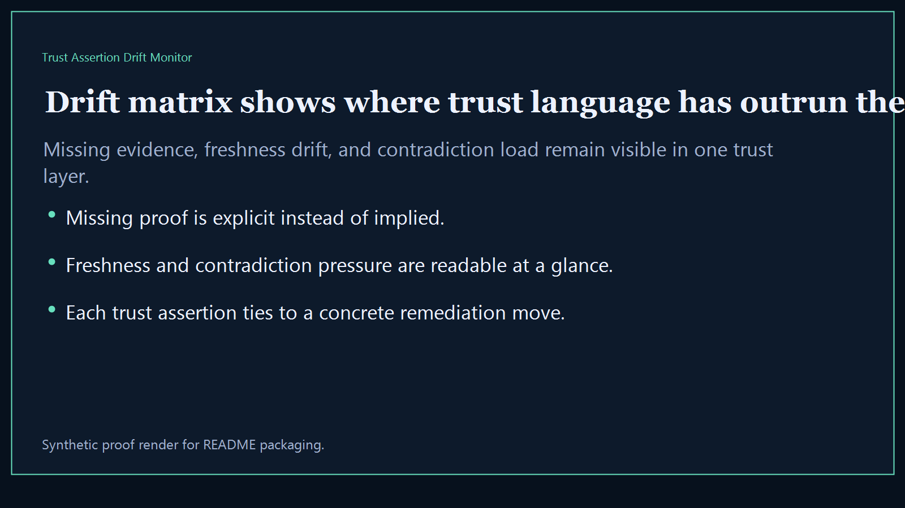
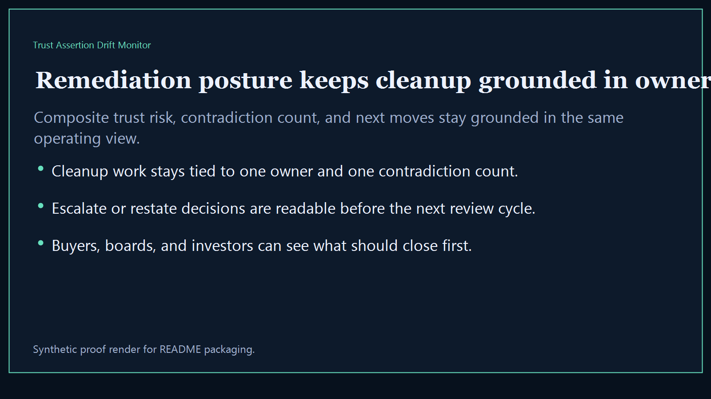

# Trust Assertion Drift Monitor

Board-ready trust intelligence surface for tracking where published assertions drift away from live evidence, ownership freshness, and buyer-safe proof posture.

- Live: `http://drift.kineticgain.com/`
- Repo: `mizcausevic-dev/trust-assertion-drift-monitor`

## Why this matters

Leaders need one drift monitor that shows which public trust claims are still well-backed, which assertions are aging away from the evidence base, and where owner follow-through is too weak for the next buyer, investor, or partner review.

## What it includes

- TypeScript executive-intelligence surface for trust-assertion drift, evidence freshness, owner accountability, and buyer-safe review posture
- synthetic trust lanes across AI governance, identity, platform operations, procurement trust, revenue systems, and regulated infrastructure
- reusable outputs for assertion register, drift matrix, remediation posture, and board-ready trust narratives
- prerendered static site, JSON payloads, screenshots, and docs

## Routes

- `/`
- `/assertion-register`
- `/drift-matrix`
- `/remediation-posture`
- `/verification`
- `/docs`

## Local run

```bash
cd trust-assertion-drift-monitor
npm install
npm run verify
npm run prerender
npm run render:assets
```

## CLI

```bash
npx trust-assertion-drift-monitor fixtures/trust-assertion-drift-monitor.json --format summary
npx trust-assertion-drift-monitor fixtures/trust-assertion-drift-monitor-clean.json --format json
```

## Docs

- [Architecture](docs/architecture.md)
- [Origin](docs/ORIGIN.md)
- [Kinetic Gain Embedded](docs/KINETIC_GAIN_EMBEDDED.md)

## Screenshots





